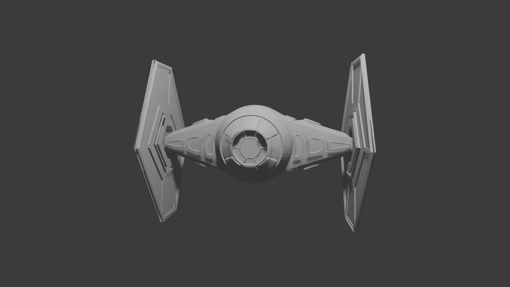
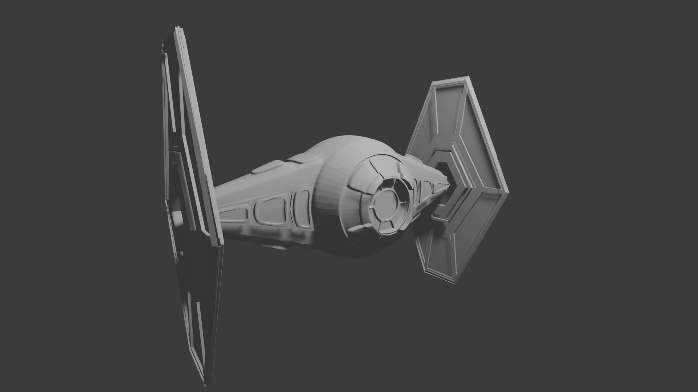

# Model 3D: Myśliwiec (Hard-Surface Modeling)
**Wykorzystane narzędzie:** Blender 3D

Projekt zrealizowany w ramach zajęć akademickich, skupiający się na modelowaniu typu *hard-surface* w programie Blender. Praca nad modelem pozwoliła mi na praktyczne zrozumienie geometrii obiektu, topologii siatki oraz zasad pracy w środowisku 3D.

## Opis techniczny
Model został wykonany w całości jako model bez nałożonych tekstur, co pozwoliło mi skupić się w pełni na poprawności geometrii i czystości siatki wielokątów.

**Kluczowe zagadnienia:**
*   **Modelowanie Hard-Surface:** Projektowanie złożonych brył geometrycznych przy zachowaniu czystej topologii.
*   **Praca z narzędziami edycji:** Wykorzystanie modyfikatorów i narzędzi do manipulacji wierzchołkami, krawędziami i ścianami.
*   **Wizualizacja:** Przygotowanie sceny i wygenerowanie renderów prezentacyjnych.

Inspiracją do powstania projektu były zaawansowane techniki modelowania prezentowane w materiałach edukacyjnych, które pozwoliły mi na samodzielne zaprojektowanie i wykonanie modelu od podstaw.

## Prezentacja wideo
Animowany objazd kamery (flyby) wokół modelu:
[Obejrzyj prezentację (presentation.mkv)](assets/presentation.mkv)

## Podgląd projektu

